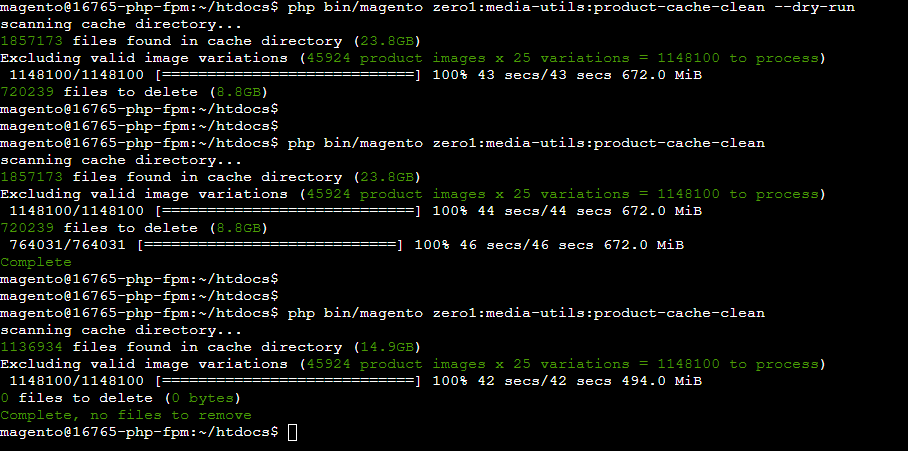
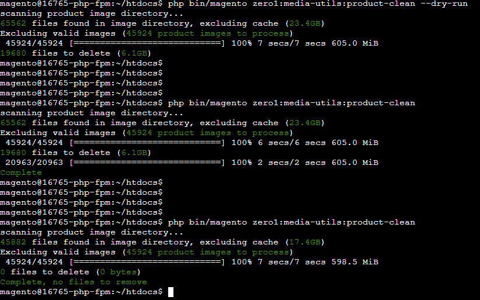

# Media Util
This module serves to add a few utility functions to the Magento CLI for working with your media assets.

- [Product Image Variation Report](#product-image-variation-report)
- [Product Image Cache Cleanup](#product-image-cache-cleanup)
- [Product Image Cleanup](#product-image-cleanup)

## Installation
```
composer require zero1/media-utils
```


## Product Image Variation Report
Magento provides a way for images to be declared in the theme xml, these declarations are named and specify how the source image should be altered. For example, setting the width to X and the height to Y.
Magento is smart enough not to create a new image if the same image parameters are specified for multiple image variants. However this only works if the image parameters are exactly the same, it can be quite easy to specify an image 1px different and there will be another image generated.

This report displays two tables.
First the image configurations that are declared, this includes:
- the themes they belong to
- the store IDs they are applicable for
- the name of the image configuration
- the parameters of the image

This can be useful to identify configurations that are similar can that can be update to make them the same, reducing the total number of image resize operations required.


Secondly how each of these variants map to a cache directory. This allows you to see which image declarations are the same.

```bash
php bin/magento zero1:media-utils:product-image-variation-report
```

## Product Image Cache Cleanup
This command assesses all files within `catalog/product/cache` and removes all that aren't a valid variation.
```bash
php bin/magento zero1:media-utils:product-cache-clean [--dry-run]
```
Passing the `--dry-run` flag, stops the process from removing any images.


## Product Image Cleanup
This command assesses all files within `catalog/product` (excluding `catalog/product/cache`) and removes all that aren't used.
```bash
php bin/magento zero1:media-utils:product-clean [--dry-run]
```
Passing the `--dry-run` flag, stops the process from removing any images.
